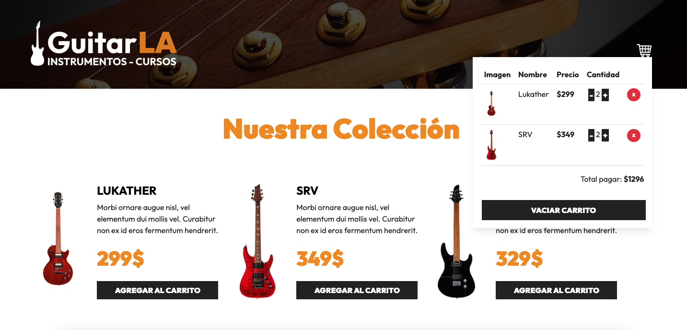

# 🎸 Ecommerce de Guitarras  

Proyecto creado con **Vite + React + TypeScript + Tailwind CSS**.  
Un pequeño ecommerce donde se pueden añadir guitarras al carrito, con persistencia en Local Storage y cálculos optimizados.  

---

## 🚀 Demo  
👉 [Pruébame aquí](https://aranda-react-guitar-ecommerce.netlify.app/)  

---

## 🖼️ Vista previa  
  

---

## 🛠️ Tecnologías  
- **Frontend**: [React 19](https://reactjs.org/) + TypeScript  
- **Estilos**: [TailwindCSS 4](https://tailwindcss.com/)  
- **Estado**: Hooks (`useState`, `useMemo`)  
- **Persistencia**: Local Storage  
- **Build Tool**: [Vite](https://vitejs.dev/)  

---

## ✨ Funcionalidades  
- Catálogo de guitarras con opción de compra  
- Carrito con persistencia en **Local Storage**  
- Cálculo de totales optimizado con `useMemo`  
- Límite de compra: máximo **5 unidades por producto**  
- Estilos **responsiv**
